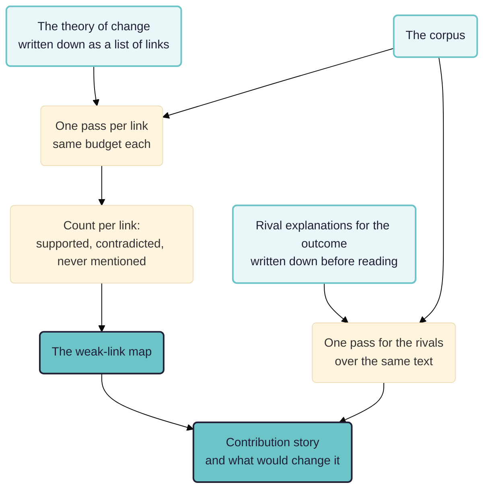

The third of three. [[010 Testing rival theories ((theory-fit))|One]] takes rival published theories and asks which the material supports. [[020 Realist mechanisms ((realist-mechanisms))|Another]] starts with no theory and generates mechanisms. This one starts with the theory the programme already wrote down, and asks what the evidence does to it.

> **Work in progress.** A design sketch. Nothing here has been run on a real evaluation, and the paper argues for a reading of contribution analysis that its commissioners often do not want.

See also: [[000 Rubicon ((rubicon))]]; [[005 Rubicon principles ((rubicon-principles))]]; [[900 A simple measure of the goodness of fit of a causal theory to a text corpus ((goodness-of-fit))]]; [[203 Task 3 -- Analysing data, Answering questions ((task3-analysing))]].

**Intended audience:** evaluators who have been asked to show that a programme contributed to a change, who have interviews and reports rather than a counterfactual, and who have to satisfy a reader entitled to be sceptical.

## What evaluations actually want contribution analysis to answer

Worth being blunt about, because the gap between what commissioners ask and what the method delivers is where most contribution analyses go wrong.

Five questions arrive dressed as one.

- **"Did our programme cause this change?"** The question as asked. Contribution analysis answers a narrower one: is there a credible account, given the evidence and given what else was going on, that the programme made a difference. Mayne's own language is reduced uncertainty and plausible association.
- **"How much of the change was ours?"** Refused, and the refusal is the method's design rather than a shortcoming. Contribution analysis produces no attribution fraction and cannot be made to. An evaluation that reports one has stopped doing contribution analysis. Say this at inception, in writing, because it is the expectation that curdles at the end.
- **"Would it have happened anyway?"** The real question underneath the first, and the one a sceptical reader will press. It is answerable only by taking the rival explanations as seriously as the programme's own account, which is the step most often skimped.
- **"What should we fix?"** The question contribution analysis answers best and is asked to answer least. A theory of change broken into links, each carrying the evidence for and against it, is a map of where the programme's own account is thin. That is more use to a programme manager than any overall verdict.
- **"Give us something that will survive audit."** Legitimate, and it is about the trail rather than the finding: what was claimed, on what evidence, decided by whom, and when relative to seeing the results.

So the useful reframing, and the one this paper builds on: **the product of a contribution analysis is not a verdict but an annotated theory of change**, showing for each link whether the material supports it, contradicts it, or never mentions it, alongside a separate account of what else could explain the outcome. The contribution story is the wrapper. The map is the thing.



## Two kinds of rival, and the one that gets skipped

Contribution analysis carries two different things called rivals, and evaluations conflate them constantly.

- **A rival to a link.** The training did not raise referral accuracy; the new form did, and it arrived the same quarter. This is local, and the evidence that settles it is local too.
- **A rival to the whole outcome.** The change would have happened anyway, or another agency's programme did it, or the outcome is a measurement artefact of how the indicator was defined, or the sites that improved were the ones already improving.

Teams test the first kind, because each link invites its own alternative, and then write a contribution story as though the second kind had been dealt with. It has not. A theory of change every one of whose links is well evidenced is still consistent with the programme having contributed nothing, if the same forces that produced the outcome would have produced those intermediate steps too.

So the whole-outcome rivals get their own coding pass, written down before the material is read, searched with the same effort over the same text. This is the same discipline the theory-fit paper argues for, and here it is the difference between a contribution story and a press release.

## A chain is as strong as its weakest link, and reports average instead

If a theory of change runs A to B to C to D, and the material says a great deal about A to B and D, and nothing at all about B to C, the story fails at B to C. It does not score three out of four.

Almost every contribution analysis reports as though it did, because the natural summary of a table is a total. So the combination rule has to be written into the rubric in advance, and it has to be closer to a minimum than a mean. Stating it in advance matters more here than anywhere else in this set of papers, because the temptation to switch to averaging arrives precisely when one link comes back empty.

Writing this paper found that Rubicon could not express that rule. A rubric could ask whether every criterion was green, or whether any was red, and could not ask how good the weakest one was, so a chain could only have been scored by the very averaging described above. The engine now takes `combine: worst`, where the weakest criterion decides, and `combine: best`, where the strongest does. It reads the order the author declared the verdicts in, best first, and refuses a rubric that never declared them, since there the order would be an accident of writing. Nesting the two is still not possible, so a chain of branches is written as branch summaries and combined once.

Two qualifications keep that from being crude. A theory of change is rarely a single chain, so a weak link in one branch is not fatal where another branch reaches the same outcome. And a link nobody mentioned is not a link the material contradicts, which is the next problem.

## Silence is not refutation, and it is not support either

Three outcomes per link, and the third is the one an evaluator cannot get any other way.

- **Supported**, with passages behind it.
- **Contradicted**, with passages behind it.
- **Never mentioned.** No passage bears on it at all.

The third only means anything because the workflow knows the full list of links in advance, so a proposition the material never touched reads as a nought in the table rather than dropping out of it. Build the table from what was found and the untouched links disappear, which is exactly the failure the method exists to prevent.

Silence has at least three readings, and the report should say which is being taken. The link is so obvious nobody remarks on it. Nobody was asked. Or it did not happen. The first two are facts about the corpus and the interview schedule; only the third is a finding about the programme. Where the corpus was gathered before the theory of change was written, which is the usual case for a Rubicon run, the safer default is that silence is uninformative and the link is unexamined rather than unsupported.

## Who is speaking matters more here than elsewhere

An implementer's account of why participants responded is the implementer's theory, and it is data about the implementer. In a contribution analysis this bites harder than in the other two papers, because the people most available to interview are the ones with the strongest interest in the contribution story being true.

Two columns earn their cost in every coding pass, both borrowed from the realist workflow.

- **First or second hand.** A programme officer reporting what a farmer felt is not the farmer.
- **Prompted or volunteered.** A respondent who raised a link unbidden is stronger evidence than one who agreed when it was put to them. In a corpus somebody else gathered, this is the only way to tell an interview that tested the theory from one that led the witness.

And a third that is specific to this method: **the speaker's relation to the programme**, so a figure can be recomputed over people with nothing to gain. Where the contribution story rests only on people paid by the programme, that is the finding.

## The workflow

The theory of change is written into the workflow as a list of links, each with its two ends, and a fan-out puts one pass onto each. The repository already carries a working example of this form in `rfa-theory-of-change.yaml`, which tests seven propositions about a proposed research funding agency against a select committee's evidence.

What a contribution analysis adds to that is the second pass and the two-part rubric.

```yaml
  - id: test_link
    type: code
    inputs: [sources]
    for_each:
      - id: convening-builds-relationship
        from: convening
        to: relationship
        text: >-
          putting researchers and civil servants in a room produces a working
          relationship that outlives the meeting
      - id: relationship-gets-evidence-used
        from: relationship
        to: evidence_used
        text: >-
          it is the relationship rather than the quality of the evidence that
          gets the evidence used later
    spec:
      model: gemini-3.5-flash
      chunk_size: 3000
      min_per_segment: 1
      instruction: >
        PROPOSITION: {item.text}

        Find every passage bearing on that proposition, for or against. A passage
        that describes the activity happening is not evidence that it produced
        what the proposition claims; mark that as background.
      columns:
        - name: stance
          type: category
          means: which way the passage cuts, taken at face value
          values:
            - name: supports
              means: taken at face value, it makes the proposition more likely
            - name: contradicts
              means: taken at face value, it makes the proposition less likely
            - name: background
              means: >
                describes the activity or the setting without bearing on whether
                the proposition holds
        - name: speaker_stake
          type: category
          means: what the speaker stands to gain from the proposition being true
          values:
            - name: delivers_the_programme
              means: paid by, or accountable for, the programme
            - name: receives_it
              means: a participant or intended beneficiary
            - name: neither
              means: an observer with nothing riding on the answer
        - name: prompted_by_interviewer
          type: category
          means: whether the speaker raised this or was led to it
          values:
            - name: volunteered
              means: the speaker introduced it themselves
            - name: prompted
              means: the interviewer named it first and the speaker agreed
            - name: unclear
              means: the transcript does not show which
        - name: certainty
          type: ordinal
          means: how sure the speaker sounds that what they describe happened
          levels:
            - name: speculative
              means: "imagining or generalising: would, might, people tend to"
            - name: reported
              means: stated as something that happened, without saying how they know
            - name: evidenced
              means: "particulars that show they were there: an occasion, a person, what followed"
    outputs:
      - name: link_evidence
        role: link_evidence
        type: quotes
```

The counting step gathers the prongs by role, so `over: {group: item}` gives a row per link and the full list of links is known from the assets, which is what lets a never-mentioned link read as a nought. A second figure computed with `where: {speaker_stake: {not: delivers_the_programme}}` says how much of the story survives without the people paid to tell it.

The rival pass is an ordinary `code` step over the same sources, with the whole-outcome alternatives named in its instruction, producing its own asset. It is not a fan-out prong of the link pass, on purpose: these are rivals to the outcome rather than to any one link, and mixing them would let a rival be counted as evidence about a link.

Then two judgements, and keeping them apart is the point.

- **Per link**, against a rubric with the three outcomes above, so the output is the annotated theory of change.
- **Overall**, against a rubric that states in advance how the links combine, how the rival explanations are weighed against the programme's account, and what would have to be true for the story to fail.

The artefact the workflow must produce, beyond either judgement, is the graph: the theory of change drawn with each link carrying what the evidence said, thickness or colour for the weight of support, something distinct for a contradicted link, and something distinct again for a link nobody addressed. That last is the column an evaluator cannot get any other way and the one most easily lost in a picture. Rubicon cannot yet draw it, and that gap is recorded in the repository rather than glossed.

## Where the people go

Contribution analysis is participatory in its own literature and Rubicon's version must not quietly drop that.

- **Agreeing the theory of change** is the first and most consequential participatory step. A theory of change nobody outside the evaluation team recognises produces a link-by-link map of somebody's imagination.
- **Naming the rival explanations.** These are best drawn from people with a reason to doubt the programme, and an evaluation team on its own reliably writes rivals it can defeat.
- **Reading the weak-link map together**, which is where this method earns its keep. The map is designed for a room rather than for a report, and the useful conversation is about the links nobody mentioned.
- **Going back for more evidence**, Mayne's fifth step. A run over an existing corpus stops before it, so the thin links become the questions for the next round of fieldwork rather than a finding.

The tension with registration is sharpest here, because the combination rule has to be fixed in advance and the pull to revise it arrives exactly when a link comes back empty. The answer is not to forbid the revision but to date it: change the rule, say why, and let the reader see that it changed after the numbers were in.

## What this cannot do

- **No attribution fraction**, ever. See above.
- **No counterfactual.** The rival pass asks what else could explain the outcome and reads what people say about it. That is weaker than a comparison group and stronger than not asking.
- **A corpus gathered before the theory of change existed cannot have had the theory put to it.** Contribution analysis in its proper form goes back for more evidence at step five, and a Rubicon run over an existing corpus stops before that. Where an evaluation is still running, the better use of this is to produce the weak-link map first and take the thin links into the next round of fieldwork as the questions to ask.
- **The unit is a source.** Contribution is claimed about a programme and evidence arrives per person, and Rubicon currently counts documents.

## Next steps

- Write the contribution analysis page in Rubicon's own knowledge base, which is the largest gap in it: the assistant is expected to offer the method and currently knows nothing about it.
- Settle the combination rule for the actual theory of change, in writing, before any run. The machinery now exists; which links form a chain and which form substitutable branches is a judgement about the programme and belongs to the people who know it.
- Build the annotated theory-of-change graph, which all three of these papers now want.
- Test the whole thing on a live evaluation rather than an archive, so that step five exists.
