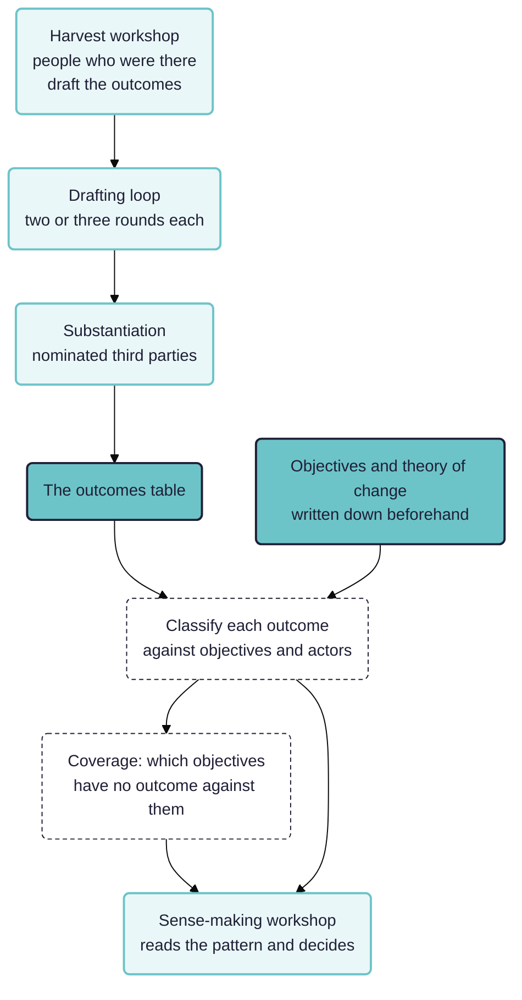

Outcome harvesting is the most participatory of the methods in this chapter and the one where a machine has least business doing the interesting part. So the question is not how to build a better outcomes table. It is which of the questions commissioners actually put to a harvest can be answered better, and which part of the work should stay in human hands.

> **Work in progress.** A design sketch, built on three published harvests read for their terms of reference rather than their findings. Nothing here has been run.

## In short

Outcome harvesting is mostly a conversation between people. The question this paper asks is which two steps in the middle a machine should touch at all.

- **We read terms of reference, not method guides.** Three published harvests, Oxfam Novib's global programme evaluation, NIMD's evaluation across Mali, Mozambique, Tunisia and Colombia, and ActionAid Denmark's Tax Justice programme. Nine questions between them, and none asks how much of the change was attributable to the funder.
- **Two questions go to the machine.** First, do these outcomes form a pattern of progress towards the objectives: classify each outcome against objectives declared in advance, then count by objective, by actor type and by year. Second, which objectives have nothing against them.
- **The second is the one an evaluator cannot get any other way.** It works only because the objectives are a declared list, so an objective no outcome touches appears as an empty cell rather than vanishing from the table.
- **Both are ordinary Rubicon.** A `code` step over the outcomes as sources, a `compute` step grouping by a declared column, and a `note` that states its base, because a harvest has no denominator and every figure has to carry that.
- **Everything else stays with people.** The harvest workshop, the drafting loop, substantiation and sense-making are all human steps, and the workflow's job there is to record that they happened and what they changed.

See also: [[000 Rubicon ((rubicon))]]; [[030 Contribution analysis ((contribution))]]; [[900 A simple measure of the goodness of fit of a causal theory to a text corpus ((goodness-of-fit))]].

## What commissioners actually ask a harvest

Taken from the terms of reference of three published harvests rather than from method guides, because what a method is for and what it gets bought for are different things.

**Oxfam Novib's global programme evaluation** asked four questions, in Wilson-Grau's own harvest: to what extent counterparts achieved outcomes and contributed to policy and practice changes; whether the programme responded effectively to a changing global context; whether counterparts added value to Oxfam's campaigning; and "How has GloPro contributed to the achievements of outcomes by counterparts".

**NIMD's evaluation across Mali, Mozambique, Tunisia and Colombia** asked three: whether the outcomes "represent patterns of progress towards their respective programme objectives", how well the outcomes "match country-level ToCs", and how suitable outcome harvesting was as a method.

**ActionAid Denmark's Tax Justice programme** asked six, one of which the report says may be unanswerable by an outcome evaluation at all.

Two things stand out. **None of the nine questions asks how much of the change was attributable to the funder.** And the recurring shapes are narrower than the method's reputation suggests:

- **What changed, in actors we do not control, including what nobody planned?** The harvest itself.
- **Do these outcomes form a pattern of progress towards the objectives?**
- **How well do the outcomes match the theory of change?**
- **How did we contribute to them?**
- **Was this method any good here?**

The second and third are analysis questions asked of an outcomes table that already exists. They are also, by the account of Rubicon's own methods notes, the thinnest area of published guidance and the place most harvests disappoint the people who paid for them. That is where this paper aims.

## Refusing is normal practice, and it is written down

A useful corrective to the idea that refusing a commissioner's question is a luxury. All three reports do it in public.

- Oxfam's evaluators **rewrote a sub-question from the terms of reference**, saying the original wording "is misleading because we agreed in the Approach paper that we would not make a comparison between planned outcomes and the outcomes actually achieved", and that they had therefore corrected it.
- NIMD's evaluators **refused a judgement of worth**: "we cannot draw conclusions about the significance of what was achieved ... since we are assessing the achievement of programmatic objectives but not the merit or value of those changes."
- ActionAid's report **declines to make recommendations at all**, citing Wilson-Grau and Britt that an outcome harvest evaluator can rarely recommend action because too many determining factors are unknown to them, and offering discussion points instead.

So the refusals in this set of papers are in good company, and the model for stating them is a sentence in the report saying what was asked, what was answered instead, and why.

## The denominator problem, in the practitioners' own words

A harvest is a search, not a sample, so a count from it has no base. The published reports say so plainly, which is more than most secondary accounts do.

Oxfam's report: the outcomes "are not exhaustive. They are a sampling of what the 38 counterparts consider to be amongst their ten most significant outcomes", and "Caution should be taken ... in making quantitative comparisons and contrasts between outcomes".

ActionAid's report is more interesting still, because it shows what replaces sampling. Representativeness is claimed through a **gap-filling round**: at the end of the harvesting workshop, participants looked at the whole set, named change areas they thought were missing or under-represented, and added outcomes in those areas the following week. The report also flags two biases in the resulting counts, that most outcomes are recent, and that a first harvest skews large, with only 6 per cent rated minor.

That gap-filling round is the method's own analogue of a coverage check, and it is participatory by construction. A machine can do something adjacent: given the outcomes and the objectives, say which objectives have no outcomes against them. It cannot do what the workshop did, which is have the people who were there notice what is missing.

## One finding that contradicts the orthodoxy

The standard line, which the [[030 Contribution analysis ((contribution))|contribution analysis paper]] also takes, is that these methods yield no attribution fraction. ActionAid's harvest did exactly that.

Change agents were **asked to rate their own contribution to each outcome as a percentage**, and the rating was recorded as a formal classification field alongside year, country, social actor and significance, with a figure of outcomes by contribution percentage. Ratings clustered above 60 per cent, with nineteen outcomes at 80 and three at 90. The evaluator then adjusted percentages downwards where the documentary evidence was thin, and substantiators rated contribution independently: of eighteen substantiated outcomes only three were rated lower than the change agent's own figure, the largest gap being 90 per cent against 50.

Worth reporting rather than tidying away. It shows the orthodoxy is a position practitioners take rather than a rule the method enforces, and it shows what the number costs: a self-rating by an interested party, adjusted by an evaluator, agreed by a substantiator the same party nominated. If a commissioner wants a percentage badly enough, this is what they get, and the workflow should make its provenance impossible to lose.

## What substantiation actually does

Oxfam's harvest substantiated every other outcome: 112 attempted, 95 independent people responded covering 66 outcomes, of which 30 were fully substantiated, 21 partially and 12 mixed. **Only three drew a disagreement.** Forty-six attempts failed because no substantiator could be reached.

Two readings, and the report supports neither over the other. Either the outcome descriptions were accurate, which is the reassuring reading. Or substantiation as practised rarely overturns anything, because the substantiators are nominated by the people whose account is being checked. The one number that would separate the readings, how often a substantiator nominated by somebody else disagrees, is not in the data.

The lesson for a workflow is not to automate substantiation but to record it properly: who nominated the substantiator, what they were asked, and whether the outcome changed as a result. A substantiation step that never changes anything should look different in the record from one that had nothing to change.

## Where the people go, and what it costs them

This method makes the participation costs visible in a way the others do not.

Oxfam's evaluators corresponded with each counterpart, typically two or three rounds, until they agreed a title, a description of what changed, when and where, its significance, and the counterpart's contribution. The team budgeted an average of 11.5 hours per counterpart, and reports that **some counterparts spent two to four times as long on it as the evaluators did**.

That is the true picture of a participatory method: the iteration is the method, and most of its cost falls on people who are not being paid to evaluate. Any proposal to speed this up with a machine has to say whose time it is saving. Drafting outcome statements faster mostly saves the evaluator's.

So the division this paper proposes:

- **The harvest stays human.** Who counts as a social actor, what counts as a change, and which ten outcomes matter most are judgements by people who were there.
- **The drafting loop stays human**, with a machine at most checking that a draft has its four parts and flagging the ones that do not.
- **The analysis is where a machine helps**, and it is the part that disappoints commissioners.
- **The sense-making returns to people.** A pattern found by a machine is a proposal to a workshop, not a finding.

Solid boxes are people, dashed are the machine. Rubicon owns two steps in the middle of a method that is otherwise a conversation.

## The two questions this workflow answers

Picking two rather than all of them, because the others either belong to the harvest or belong to a workshop.

**One: do these outcomes form a pattern of progress towards the objectives?** A coding pass over the outcomes table, classifying each outcome against the objectives declared in advance, then counting by objective, by actor type and by year. The counting is where the denominator problem bites, so every figure states that its base is the harvested set and not the world, and the report says so once, prominently, rather than in a footnote.

**Two: which objectives have nothing against them?** The mirror of the first, and the one an evaluator cannot get any other way. It works only because the objectives are a declared list, so an objective no outcome touches reads as a nought rather than dropping out of the table. This is the machine analogue of ActionAid's gap-filling round, and it should be run *before* the sense-making workshop so the workshop has something to argue with.

Both are ordinary Rubicon: a `code` step over the outcomes as sources, a `compute` step grouping by a declared column, and a `note` that states its base. The declared list of objectives goes in as a fan-out or as a category column with its values fixed in advance, which is what makes the empty cells appear.

## What this cannot do

- **It cannot do the harvest.** No machine reading documents afterwards can replace a room of people deciding what changed.
- **It cannot give a count that means anything on its own.** A harvest has no denominator, and every figure has to carry that.
- **It cannot judge worth**, which NIMD's evaluators refused in as many words, and which in Rubicon needs a rubric somebody registered.
- **It cannot substantiate.** Substantiation is a person going on the record. The workflow can only record that it happened and whether it changed anything.
- **The unit problem again.** An outcome is about a social actor, and Rubicon counts documents.

## Next steps

- Write the contribution analysis and outcome harvesting pages into Rubicon's own knowledge base, which already carries seven pages on harvesting and none on what commissioners ask of it.
- Get hold of a real outcomes table with its objectives, and run the two questions above against it.
- Decide how a harvest's lack of a denominator is expressed in the machinery rather than in prose, so that a figure from a harvested set cannot be reported as though it had a base.
- Record substantiation as a first-class thing: who nominated whom, what changed, and what did not.
