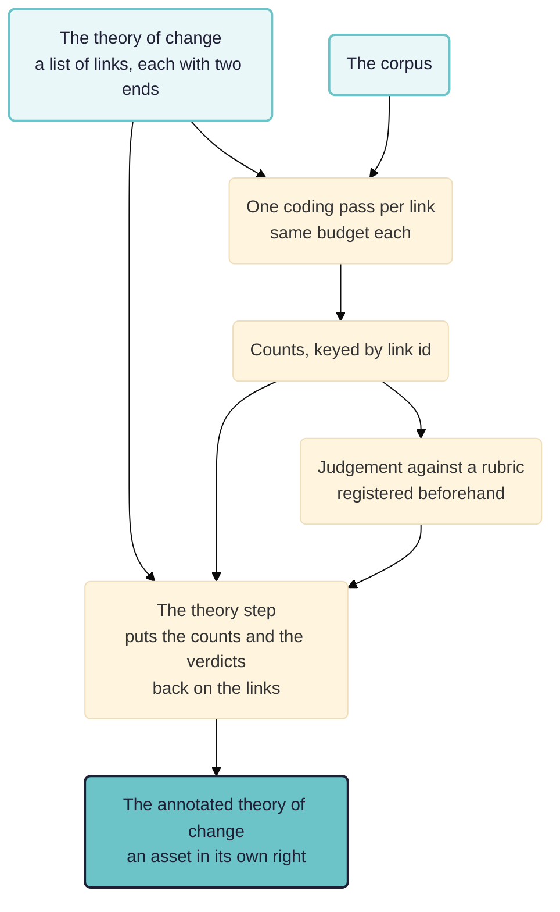

The family the other method papers belong to. Contribution analysis, realist evaluation and process tracing all state a theory in advance and then put it to the material. Commissioners ask for that in general terms far more often than they ask for any one of them by name. This paper is about what comes back at the end. It reports a run rather than a design, because the thing that comes back now exists.

> **Work in progress.** The `theory` step was written on 6 September 2026 and has run once, on the app's own example project rather than on an evaluation. Every figure below is from that run. The drawing shipped with a fault on the way, reported here rather than tidied away, because it was our own argument turned on us. Comments welcome.

## In short

An evaluator who wrote a theory of change as a diagram wants the answer back as one.

- **Theory-based evaluation is the family and the papers here are its members.** [[030 Contribution analysis ((contribution))]] starts from the theory the programme committed to. [[020 Realist mechanisms ((realist-mechanisms))]] generates one where nobody has written it yet. [[010 Testing rival theories ((theory-fit))]] adjudicates between several. All three do the same thing first: write the theory down, then read.
- **Testing a theory produces a table.** A table is not the theory. A fan-out over eight links comes back as counts keyed by link id, without the branch structure the evaluator drew in the first place.
- **The structure was already in the workflow and nothing read it.** Asked to test a theory of change, Ruby writes each link with a `from` and a `to` beside its proposition, unprompted. The fan-out took the list, named each prong after its id, and let both fields go the way of every other key a step spec does not read.
- **A `theory` step now assembles the graph and files it as an asset.** It invents nothing. The structure comes from the fan-out list the workflow declares, the numbers from the counting step, the verdicts from the judging step. It reads the list with `links_from: <the step that fans out over the links>`, so the list exists once. The copy that gets drawn is then the copy that was coded.
- **The run.** `verify-toc-pathways` against `example-original-rubicon`: eight links, nineteen documents, 590 coded passages, one whole-theory figure of 572 supporting quotes, two branches converging on wellbeing.
- **Three findings the drawing must never confuse.** Supported, contradicted, or addressed by nobody. The third is the one an evaluator cannot get any other way. It is also the first thing a picture loses.
- **What it does not do.** There is no held-out half here and no synthetic contrast set. A per-link verdict appears only where a rubric criterion was named after a link, which in this run was true of none of them.

See also: [[000 Rubicon ((rubicon))]]; [[005 Rubicon principles ((rubicon-principles))]]; [[030 Contribution analysis ((contribution))]]; [[900 A simple measure of the goodness of fit of a causal theory to a text corpus ((goodness-of-fit))]].

**Intended audience:** evaluators who have been asked for a theory-based evaluation without being told which one, who have a theory of change and a pile of documents, and who must show the result to the people who drew the theory.

## What commissioners are asking for when they ask for this

Terms of reference say "theory-based" far more often than they say "contribution analysis" or "realist evaluation", and usually without saying which. That vagueness is not carelessness. What the commissioner wants is the family resemblance rather than any member's apparatus. There is a theory about how this was supposed to work. Somebody wrote it down. The question is what the evidence does to it.

Three of the members are in this chapter. They differ in where the theory comes from.

- **Somebody already committed to it in writing.** That is contribution analysis. The theory of change is the programme's own. Arguing with it is part of the job.
- **Nobody has written it yet.** That is realist evaluation's retroduction. The theory has to be generated from the material before anything can be put to it.
- **Several people have written rival ones.** That is the process tracing case. The job is adjudication rather than confirmation.

What they share is the ordering. The ordering is the whole of the discipline. The theory is fixed, dated and named before the reading starts. A reader can then tell a proposition that survived contact with the evidence from one written afterwards to fit it. Everything Rubicon does is machinery for making that ordering visible. The machinery is the same whichever member is being run, which is why the assistant builds a workflow out of general parts instead of picking a named method off a menu.

They share a deliverable too, which is where this paper starts. The product is not a verdict. It is the theory of change with what the evidence said hung on each link of it. A programme manager can then see which parts of their own account the material bears out and which parts it never touched.

## The table and the diagram are not the same result

Put eight propositions to nineteen documents and the result arrives as a table: one row per link, with how many passages bore on it, how many supported it, how many contradicted it. That is the truthful form of the finding. It is the wrong form for the person who has to read it.

An evaluator wrote the theory as a diagram. A programme committed to it as a diagram. The workshop that argues about the result will argue in front of a diagram. A table keyed by link id cannot show that two branches converge, that one arm of the theory rests on a great deal of material while the other rests on almost none, or that a whole limb went unexamined. Those are findings about the theory rather than about any of its links. They only exist once the links are back in their places.

So what was missing is not a picture of the same information. It is information the table never held.



The theory of change goes in twice. That is the point of the diagram: once to say what to look for, once to say where to put what was found.

## The structure was already there

Asked to verify a theory of change, Ruby wrote the workflow as a fan-out over eight propositions. She gave every one of them two ends without being asked to:

```yaml
- id: f-harvests
  from: farming knowledge
  to: better harvests
  text: Farming knowledge (F) leads to better harvests
```

All eight prongs have both. A graph is what a theory of change is, so writing one down produced a graph. The app then did nothing at all with `from` and `to`. The fan-out reads the list, names each prong after its id, and those two fields join every other key a step spec does not read.

That is worth separating from a missing feature, because it is the more interesting failure. The information was present, declared by the assistant, stored on the run, and thrown away at the point of use. Meanwhile `principles.md`, which is what Ruby reads, told her in those words that the product of a contribution analysis is an annotated theory of change. It gave her no output type to declare one as. So she wrote the structure into a fan-out and hoped.

## What the step does, and what it refuses

`rubicon/rubicon/steps/theory.py` assembles the graph and files it as an asset of type `theory_of_change`. It calls no model, produces no evidence of its own, and cites none. Every number on it came from an asset it was handed, and `derived_from` names those, so the walk from a link to the passages behind it is the walk that already existed: link to figure, figure to coded row, row to quote, quote to the words in the document.

It reads the list of links with `links_from: <the step that fans out over them>`, which means the list is written once. That was a choice between two places the structure could have been kept. The reason for it matters more than the mechanism. The workflow as executed is already stored verbatim on the run. Nothing new has to be recorded for the graph to be durable. Neither is there a second copy free to drift away from the list that was actually coded.

The refusals are worth reading. Each one is a drawing that would be wrong in a way the reader cannot see.

- **A link with one end missing** is refused by name, and the message names that link rather than the others. A theory of change is a graph. An arrow pointing nowhere is not a weaker version of an arrow.
- **A `links_from` naming a step that does not exist** is refused with a list of the steps that do. One naming a step that does not fan out is told so in as many words.
- **A theory with nothing hung on it** is refused outright. Given neither a table nor a judgement, what would be drawn is the workflow read back rather than a result.

The distinction the payload works hardest to keep is between absent and nought. A figure that never covered a link is not a link the material ignored. So an uncounted link is stored as null, with a `counted` flag saying which of the two it is. That distinction is the first casualty of any drawing. It is also the one an evaluator cannot recover from anywhere else.

## The run

`verify-toc-pathways`, version 3, against `example-original-rubicon`, on 6 September 2026, run `7b13fa55`. The corpus is the app's own example project: nineteen household interview transcripts, anonymised, from two provinces. The theory of change runs from training through farming and health knowledge to wellbeing, in eight links.

The coding fanned out over all eight links across all nineteen documents and produced **590 coded passages**, every one of them quoting a passage that was then located in its document. 588 matched exactly. Two matched with a gap. All nineteen documents are quoted somewhere in the result. The coding cost $4.05 on the run that did it, using `gemini-3.5-flash`. The run reported here reused those codings and cost nothing.

The counting step produced two figures per link and one for the theory as a whole. The whole-theory figure is **572 supporting quotes**. Per link, the count of supporting passages runs from 56 on each of the two training links to 100 on "better health practices lead to improved family health". The two health links are the best evidenced of the eight, at 94 and 100 against 73 for the next highest. All eight links were counted. None came back empty.

One caution on reading those figures, which generalises. The per-link figure is called `supporting-sources-count` and it counts passages rather than sources: its eight values sum to 572, the total number of supporting quotes, over a corpus of nineteen documents. Nothing is wrong with the arithmetic. The name is simply a lie about what was counted. A figure's name is written by whoever wrote the workflow, and an annotated diagram puts that name next to the arrow it is supposed to describe, which is the cheapest place anybody will ever notice.

The graph the step assembled has eight factors and eight annotated links, and **two branches converge on wellbeing**: one through better nutrition, one through improved family health. That convergence is the part a table keyed by link id could never show. It changes how the result should be read, because a weak link in one branch is not fatal where the other reaches the same outcome.

The judgement is one verdict for the whole theory, `fully_supported`, against a rubric registered on 3 September 2026 with a single criterion. Its standard for that verdict is that all eight links have at least two supporting sources, which 572 passages clears without effort. The verdict is close to uninformative. Saying so is the point: what does the work here is the annotation, link by link, with the rubric a coarse gate in front of it.

## Three findings a drawing must never confuse

The colours on the diagram say three different things. One of them is why the diagram exists.

- **Supported**, with passages behind it.
- **Contradicted**, with passages behind it.
- **Nobody addressed it.** No passage bore on the link at all.

A diagram showing the last two alike would lose the column an evaluator cannot get any other way. It would lose it silently, because a faint arrow and a contradicted arrow look equally like bad news. They are opposite findings. One says the material disagrees with the programme's account. The other says nothing about the programme at all: it is a fact about the corpus and the interview schedule. Where the documents were gathered before the theory of change was written, which is the usual case, the safer reading is that the link is unexamined rather than unsupported.

The drawing now carries a fourth reading, "counted, not judged", for a link the run counted under a name the drawing does not understand. That is a statement about what can be told from the record. It belongs on the picture for the same reason the other three do.

## The fault we shipped, which is this paper's own argument turned on us

The drawing decided a link's colour by reading four figure names: `bearing_on_it`, `supporting`, `contradicting` and `evidenced`. Those are a convention. The code treated them as a rule.

`verify-toc-pathways` counts `strong-support-count` and `supporting-sources-count`. Neither is on the list. So all eight of its links matched none of the four names, every count read as zero, and the diagram drew all eight as **nobody addressed it, over 572 supporting quotes**.

That is exactly the false statement the three colours exist to prevent, one step further along. Saying nobody looked at a link the run counted is worse than saying nothing. It is a finding a reader will act on: it points a programme manager at a limb of their theory that supposedly went unexamined, when the machine had in fact read every document and found the material there.

Two things follow. Both are now in the code. A link the run counted has been addressed whatever its figures are called, so `counted` is held separately from the four names, which lets the drawing say it cannot tell what the material concluded. It may not say nobody looked. And a hardcoded list of names deciding how a result reads is the same fault this chapter keeps finding elsewhere: a check that passes by matching nothing, reporting a negative it never earned.

The legend underneath had the same fault by a second route. It was tallying the links by one rule while the arrows beside it were being coloured by another, announcing eight unaddressed links next to eight coloured arrows. One rule now decides both, with a test that fails on the old wording.

## What this does not do

- **There is no held-out half here and no synthetic contrast set.** The other papers in this chapter argue for both. Neither exists in this run. What happened was that a theory was put to a corpus and the result reported. Nothing establishes that the same machinery would have found a different answer had the theory been wrong.
- **A per-link verdict only appears where a rubric criterion was named after a link.** The step matches criteria to links by name, which is the only correspondence the record actually holds. In this run the rubric has one criterion covering the whole theory. Every link's verdict is therefore null, and the colours come from the counts alone.
- **The counts are of passages rather than of people or of documents**, unless a workflow says otherwise. The unit problem stated in the other papers is unchanged. Contribution is claimed about a programme, evidence arrives per person, and Rubicon counts what it was told to count.
- **Nothing here judges worth.** A theory of change every link of which is well evidenced can still be a theory about something not worth doing. That is a judgement for a rubric somebody registered and put their name to.
- **One run, on an example project.** No evaluation has used this.

## Next steps

- Run it on a real theory of change, with a rubric whose criteria are named after the links, so the per-link verdicts appear and the annotation says what was judged rather than only what was counted.
- Put a contradicted link and an unaddressed link into the same run on purpose. The three colours would then be seen doing their work rather than asserted to.
- Let the rest of the machinery accept a theory of change as an answer: taken into a report section, elevated as the answer to a question, compared between two runs of the same theory.
- Take the whole-outcome rival pass from [[030 Contribution analysis ((contribution))]] and put its result on the same picture. A theory whose every link is supported is still consistent with the programme having contributed nothing.
