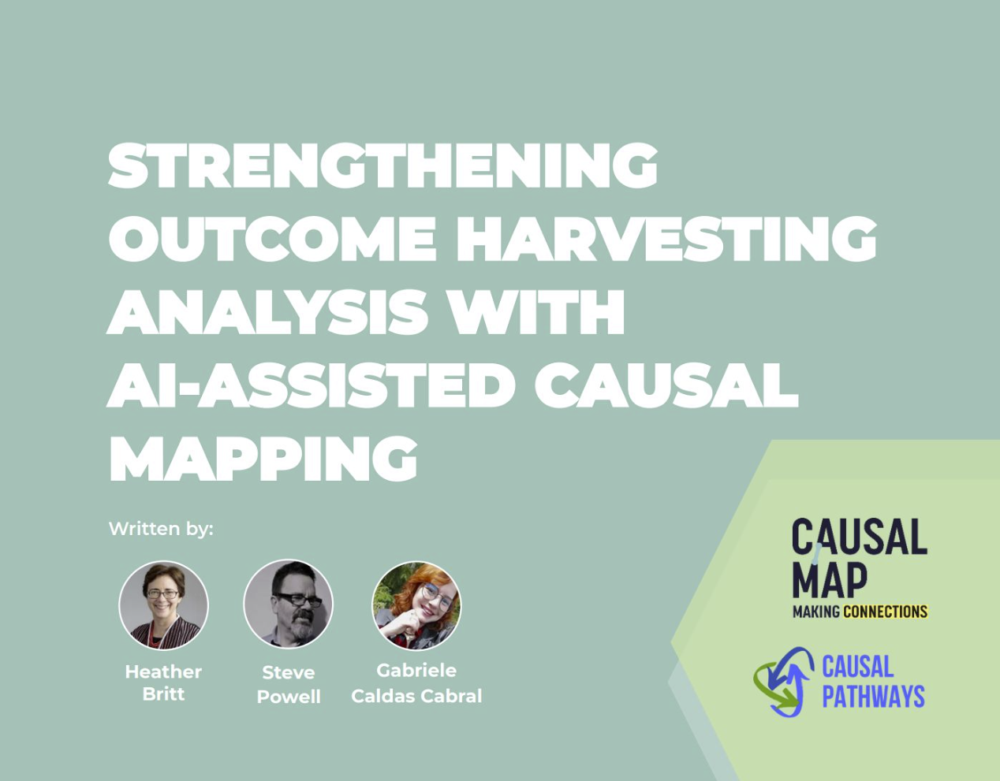

This is just an internal note to remind us what styles are available in the Garden.

## Page layout (YAML)

- `layout: showcase` or `layout: fullscreen` — `body` gets `layout-fullscreen` (sidebars and breadcrumb hidden by default; fullscreen nav; wide content). Independent of short URL `((…))` in the filename.
- **HTML typography:** visible `--` in prose is normalized to an em dash `—`. Fences for callouts (`--` on its own line before/after `{.panel}` etc.) are stripped before that pass; keep closers on their own line after blocks like images.

## Multi-column (Obsidian)

The `--- start-multi-column` / `--- end-column ---` / `--- end-multi-column` syntax becomes a Bootstrap **`row`** with **`col-md-*`** columns (classes depend on `largest column:` in `column-settings`). Callout blocks below work **inside** each column.

--- start-multi-column: ExampleRegion11  
```column-settings  
number of columns: 2  
largest column: left  
```

Text displayed in column 1.

--- end-column ---

Text displayed in column 2.

--- end-multi-column

## Captions for tables and images

An italicised paragraph on the line immediately after a table or image is promoted to a caption:

- after a `<table>` it becomes a `<caption>` element inside the table (`caption-side: bottom`)
- after a standalone image it wraps the image in `<figure>` with a `<figcaption>` underneath
- after a `.cm-figure-span` image (the full-width wrapper) the wrapper is upgraded to `<figure class="cm-figure-span">` so the full-width treatment carries through

```
| H | H |
| - | - |
| c | c |
*Comparison between holistic and claim-by-claim coding styles*
```

```

*Figure 1: what the image shows.*
```

The italicised line must be the only content of its paragraph (just `*text*`, nothing else). If you need bold or other inline formatting inside the caption, nest it inside the italics.

## Full-width on paper pages: `.span-cols`

Paper pages (YAML `tags: paper` or `type: article`) flow body content into two columns. Wide tables squeezed into one column are unreadable. Add an HTML comment marker on a blank line above the table to break it out and span the full page width in HTML and PDF:

```
<!--span-cols-->

| Dimension | Holistic | Claim-by-claim |
| --------- | -------- | -------------- |
| ...       | ...      | ...            |
```

The comment is invisible in Obsidian's reading view, so the table still renders natively; the build picks up the marker and wraps the table in `<div class="span-cols" markdown="1">...</div>`.

Images use a shortcut: add `{.span-cols}` to an image and the build wraps it in `.cm-figure-span`, which gets the same treatment.

For any other block (figure, mermaid diagram, code, custom HTML), use the explicit wrapper:

```
<div class="span-cols" markdown="1">

...your block here...

</div>
```

The `markdown="1"` attribute is required by python-markdown's `md_in_html` so inner markdown still parses. The build auto-injects it on `.span-cols` divs if you forget, but it has no effect in Obsidian's reading view, so the inner markdown won't render there. Use the `<!--span-cols-->` marker if you want Obsidian compatibility.

## Heading styles

- `.rounded` - Rounded box with light background and left border
- `.rounded-left` - Left border with subtle gradient background
- `.banner` - Full-width banner with white text on colored background
- `{.hero}` - Hero heading (light teal band, sans font). Use: `# Heading {.hero}`

Hero and h1–h3 use modern sans font (HTML and PDF).

**Examples:**

# Heading 1 rounded{.rounded}

Some normal text

## Heading 2 rounded{.rounded}

Some normal text

## Heading 2 rounded-left{.rounded-left}

Some normal text

## Heading 2 banner{.banner}

Some normal text

### Heading 3 rounded{.rounded}

Some normal text

### Heading 3 rounded-left{.rounded-left}

Some normal text

### Heading 3 banner{.banner}

Some normal text

# Causal Mapping: the evaluator's engine room {.hero}

Marshalling causal evidence at scale for Contribution Analysis and beyond.

## Box styles

Use `--{.type-modifiers}` syntax. Closing line must be **`--`** alone on its own line — keep it separate from preceding raw HTML (``) or the fence is not recognised. Use `==label==` for highlighted lead labels (e.g. `==CM Win:==`).

**In generated HTML**, blocks become `<div class="callout callout-TYPE …">…</div>` (e.g. `callout-panel`, `callout-step`, `callout-tip`, `callout-info`, …).

**Showcase callouts:**

- `--{.panel}` ... `--` - Card/panel (intro blocks)
- `--{.step}` ... `--` - Step card (numbered process sections). Use headings (`### Title`) or list-style (`1)`, `1.`, `a.`, `b.`, etc.); each gets a numbered circle.
- `--{.card}` ... `--` - Generic card (bordered, subtle shadow)
- `--{.stat}` ... `--` - Stat/KPI block (big number + label, centred)
- `--{.testimonial}` ... `--` - Quote block (italic body, attribution in last para)
- `--{.cta}` ... `--` - Call-to-action (centred, prominent border)
- `--{.alert}` ... `--` - Alert/warning (yellow accent)

**Basic callouts:** `info`, `warning`, `tip`, `note`

**Modifiers:** `narrow`, `right`, `center`, `heavy`, `left-border`, `rounded`, `inverted`

### Obsidian callout syntax (also works)

You can also write callouts in Obsidian's native syntax, which the build tool converts to `--{.type}` blocks. This is useful because they render natively in Obsidian as well.

```
> [!tip] Optional title
> - bullet
> - bullet
```

becomes a `.tip` callout with **Optional title** as a bold lead and the bullets as body. Drop the title line if you don't want one.

**Foldable variants.** Append `+` or `-` to the type to render the callout as a `<details>`/`<summary>` pair:

- `> [!tip]+ Title` opens by default; the title becomes the summary, the body is collapsible.
- `> [!tip]- Title` starts closed; click the summary to expand.

The title becomes the clickable summary (defaults to the type name if absent). In PDF output, foldable callouts always render fully expanded.

Plain blockquotes (`> ...` without `[!type]`) are left as blockquotes, except on `paper` pages (where they become `.note` callouts) and `case_study` pages (where they become `.tip` callouts).

**Type aliases.** The four native types pass straight through: `note`, `info`, `tip`, `warning`, plus `alert`. Other Obsidian types are mapped to the closest match:

- *tip*: `success`, `done`, `check`, `important`, `hint`
- *info*: `summary`, `abstract`, `tldr`, `todo`, `question`, `help`, `faq`, `example`
- *warning*: `caution`, `attention`
- *alert* (red): `failure`, `fail`, `missing`, `danger`, `error`, `bug`
- *note*: `quote`, `cite`

Anything not listed falls back to `.note`. Modifiers (`narrow`, `right`, etc.) are only available via the `--{.type-mod}` syntax, not via Obsidian callouts.

**Examples:**

> [!tip] Three rules that always apply
> - First rule
> - Second rule
> - Third rule

> [!warning] Watch out
> This will render with a yellow border.

> [!info]
> No title, just an info block.

> [!tip]+ Foldable, open by default
> This block can be collapsed by the reader. The title becomes the summary.

> [!warning]- Foldable, closed by default
> Hidden until the reader clicks the summary line.

### Showcase callout examples

--- start-multi-column: PowerTool
```column-settings
number of columns: 2
largest column: right
```

--{.panel}

# A heading in a panel

> Panel content

Panel content
--

--- end-column ---

--{.panel-inverted}

# A heading in a panel-inverted

> Panel content

Panel content
--

--{.card-inverted}

# A heading in a card-inverted

> card content

card content
--

--{.panel}
- Bullet 1
- Bullet 2
--

--- end-multi-column

--{.step}
### 1. Set out the Attribution Problem
Define the evaluation questions.
==CM Win:== Clear causal pathways.
--


--{.step}
### Set out the Attribution Problem
Define the evaluation questions.
### Develop the Theory
==CM Win:== Clear causal pathways.
### Code the map
--


--{.step}
1) Set out the Attribution Problem
Define the evaluation questions.
2) Develop the Theory
==CM Win:== Clear causal pathways.
3) Code the map
blah
--


--{.card-heavy}
### card-heavy
Define the evaluation questions.
--

--{.card}
### card
Define the evaluation questions.
--

--{.stat}
# 40%
Define the evaluation questions.
--

--{.testimonial}
### testimonial
Define the evaluation questions.
--

--{.cta}
### cta
Define the evaluation questions.
--

--{.alert}
# alert
Define the evaluation questions.
--

--{.info}

This is an info callout with a blue border.

Can include multiple paragraphs.

--

--{.warning}

This is a warning callout with a yellow border.

- Can include lists

- Bullet points work

--

--{.tip}

This is a tip callout with a green border.

--

--{.note}

This is a note callout with a gray border.

--

--{.info-narrow-right-heavy}

Right-aligned narrow callout with heavy border.

--

--{.tip-narrow-center-left-border}

Centered tip with left border only.

--

--{.warning-narrow-right-heavy-inverted}

Strong inverted warning callout.

- item 1

- item 2

--

--{.note-rounded}

Rounded box style (no left border).

--

--{.info-rounded-narrow-center}

Centered rounded info box.

--


--{.warning-heavy}

Full-width warning with heavy border.

--

--{.tip-right}

Right-aligned tip callout.

--

--{.info-inverted}

Inverted info callout with colored background.

--

--{.box}

This is a simple bordered box for highlighting content.

Can include lists and other markdown.

--

All styles work in both HTML and PDF outputs.
